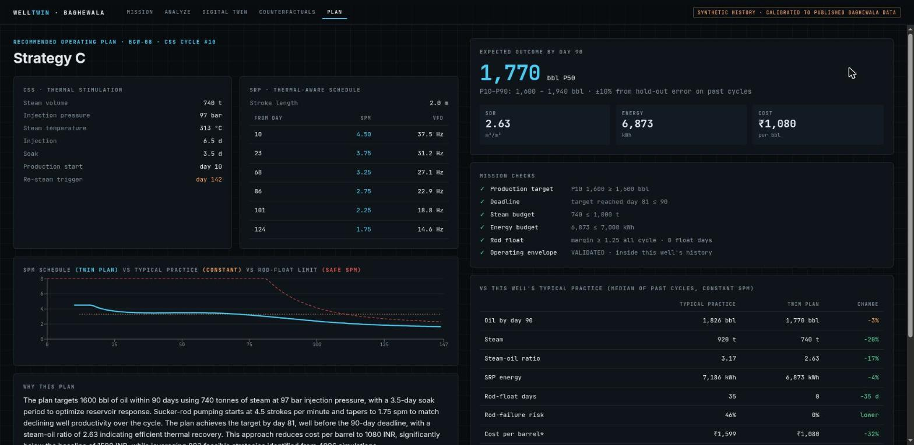
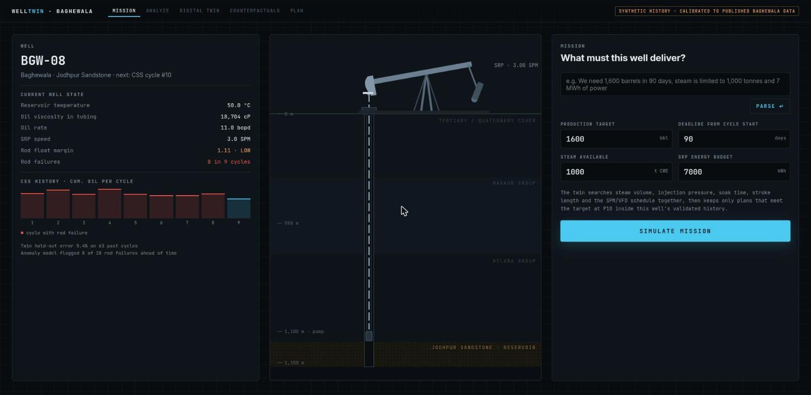
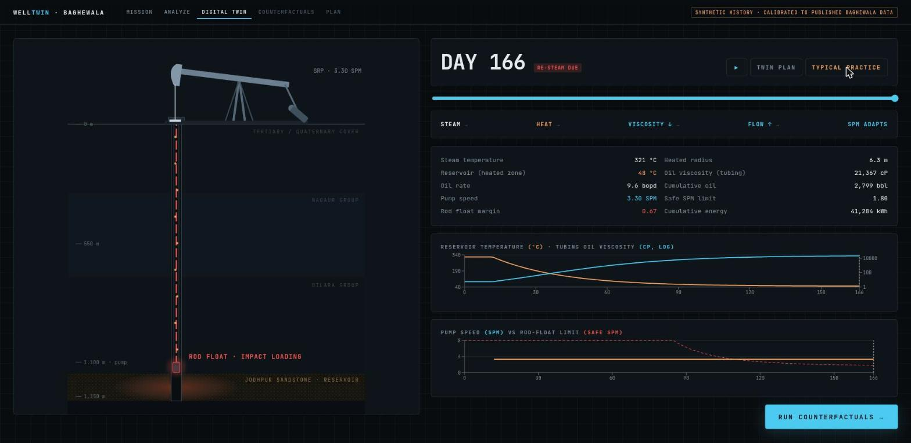
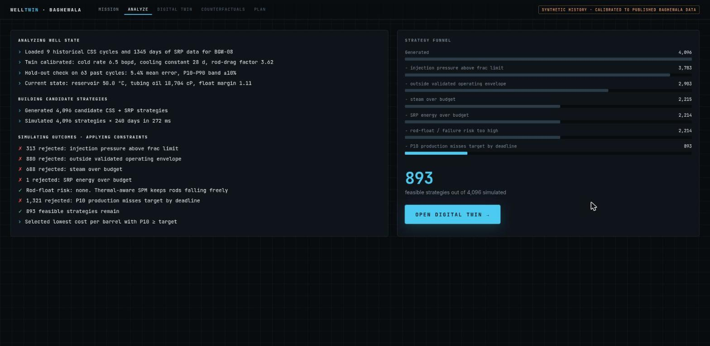
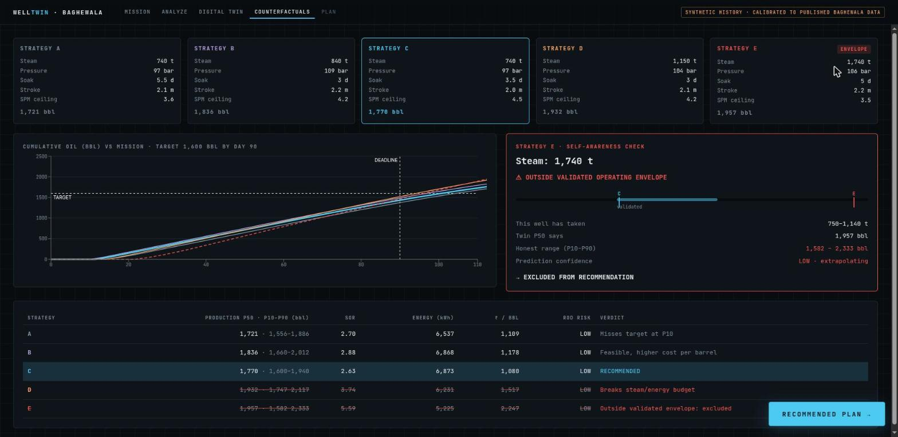
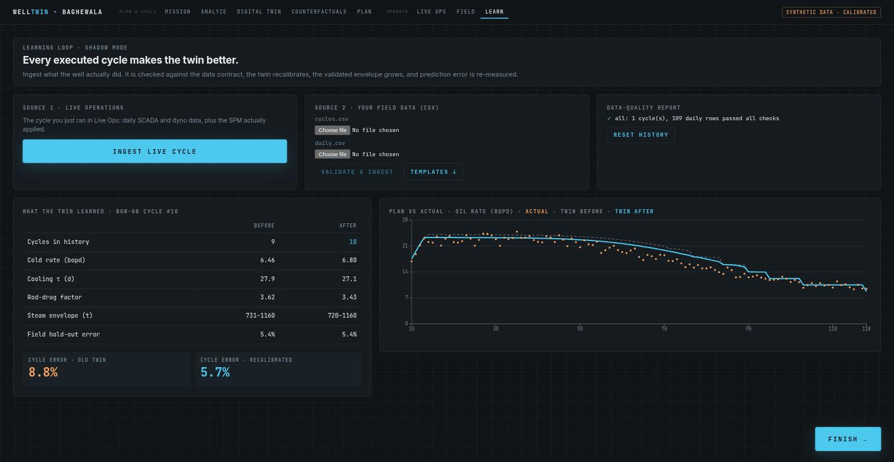
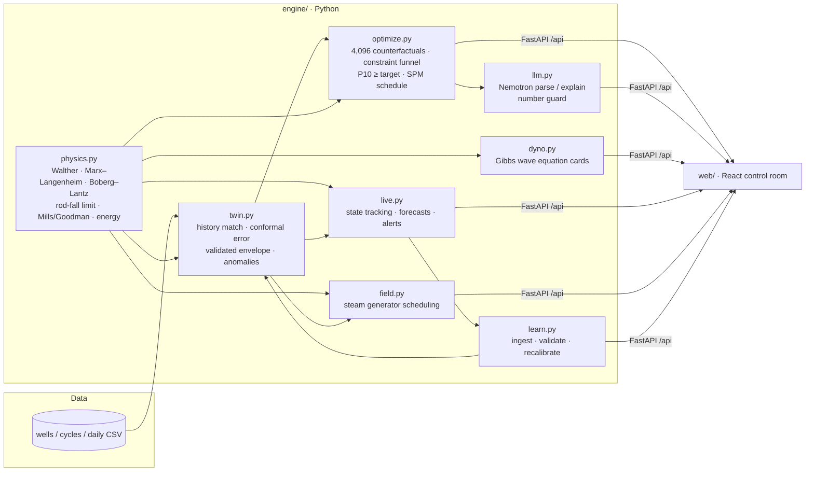

<div align="center">

# WellTwin · Baghewala

**Mission-driven digital twin for coupled CSS + SRP optimization of heavy-oil wells**

Smart India Hackathon 2026 · Problem Statement **SIH26120** · Oil India Limited · Software · Smart Automation

*Don't experiment on the well. Experiment on its digital twin first.*



</div>

---

## The problem

Baghewala (Rajasthan) produces **17–19° API crude at 10,000–13,000 cP** from a 46–48 °C Jodhpur Sandstone reservoir at ~1,150 m. Oil India makes it flow with **Cyclic Steam Stimulation (CSS)** and lifts it with **sucker-rod pumps (SRP)**. Today those two systems are tuned separately, from historical practice, and reactively.

They are one coupled problem:

```
steam → hot reservoir → oil viscosity ↓ → production ↑
      … weeks later …
reservoir cools → viscosity ↑ → rods can't fall through the oil on the downstroke
      → ROD FLOAT → impact loading → rod failure / pump unseating → workover
```

**The safe pump speed falls continuously as the well cools.** A constant SPM set while the well is hot is what breaks rods late in the cycle. Meanwhile, the CSS design (steam, pressure, soak) decides how fast the well cools.

## What WellTwin does

An engineer states a **mission**: *"1,600 bbl in 90 days, 1,000 t of steam, 7 MWh of power."* WellTwin then:

1. **Calibrates a twin to this well.** Physics model history-matched to its past cycles, with honest hold-out error.
2. **Simulates 4,096 coupled strategies** (steam, pressure, soak, stroke, SPM ceiling) × 240 days in ~0.3 s.
3. **Rejects** anything that breaks frac pressure, budgets, rod-float safety, or the **validated operating envelope** (what this well has actually done).
4. **Recommends one plan** that meets the target at **P10** at the lowest cost per barrel, including a **thermal-aware SPM/VFD schedule** that steps pump speed down before the rods float, and a re-steam trigger day.
5. **Explains it** with NVIDIA Nemotron, behind a guard that blocks any number the engine didn't compute, and cites the closest past cycles as evidence.

### Then it keeps working after the plan is issued

| Module | What it does |
|---|---|
| **Live Ops** | The twin shadows the well through the cycle on daily SCADA + dyno data. It re-estimates cooling and rod drag as they drift, forecasts float three weeks ahead, and proposes a concrete SPM/VFD change for the operator to approve or reject. Every decision goes to the audit log. |
| **Dynamometer cards** | Surface and downhole cards solved from the Gibbs damped wave equation using the twin's viscosity, so they morph as the well cools and show rod-float separation and fluid pound. |
| **Field scheduler** | With limited steam generators, decides which well to steam next by incremental oil per generator-day, and compares against steaming wells in turn. |
| **Learning loop** | Ingest the executed cycle (or OIL CSV exports). Data-quality checks run, the twin recalibrates, the envelope grows, and plan-vs-actual error is re-measured. |

| Mission | Digital twin (typical practice → rod float) |
|---|---|
|  |  |
| **Decision trace** | **Counterfactuals: E rejected as out-of-envelope** |
|  |  |
| **Learning loop** | |
|  | |

### Demo result (well BGW-08, synthetic history)

| | Typical practice | WellTwin plan | Change |
|---|---|---|---|
| Steam | 920 t | 740 t | **−20%** |
| Steam-oil ratio | 3.17 | 2.63 | **−17%** |
| Rod-float days | 35 | 0 | **−35 d** |
| Rod-failure risk | 46% | ~0% | lower |
| Cost / bbl (incl. expected workover) | ₹1,599 | ₹1,080 | **−32%** |
| Oil by day 90 | 1,826 bbl | 1,770 bbl (P10 1,600) | −3%, target met |

Twin hold-out error on 63 unseen past cycles: **5.4%**.

| Operate | Result (synthetic) |
|---|---|
| Live Ops, emulsion raises rod drag mid-cycle | Float forecast **19 days ahead**; approving the SPM cut takes forecast float days from 25 to 0 for −14 bbl |
| Field, 8 wells, 1 steam generator, 180 days | Oil +2%, steam **−17%**, field SOR 3.84 → 3.10, rod-float days 100 → 0, net value **₹7.27 → ₹8.32 cr** |
| Learning loop, cycle #10 ingested | Error on that cycle 8.8% → **5.7%** after recalibration |

> These are **model estimates on synthetic history** calibrated to published Baghewala data. No public field dataset exists; see [Data](#data).

## What makes it different

| WellTwin | Typical approaches |
|---|---|
| **Couples thermal cycle ↔ artificial lift**: SPM follows the cooling curve | Optimize SRP (e.g. XSPOC) *or* CSS (proxy models) |
| **Mission in, one plan out** (P10 ≥ target) | Dashboards and Pareto charts to interpret |
| **Knows its limits**: validated envelope, conformal P10–P90, evidence cycles | Point predictions that silently extrapolate |
| **LLM cannot invent numbers** (number guard + deterministic fallback) | LLM chat over data |
| Laptop-class, offline-capable, uses existing CSV exports, no new sensors | Cloud platforms and new instrumentation |

## Quick start

Requirements: Python 3.12+ with [`uv`](https://docs.astral.sh/uv/), Node 22+.

```bash
make up        # install deps, start API :8765 + UI :5199
make down      # stop
make help      # all commands (test, demo, build, data, logs, …)
```

Open **http://localhost:5199** and press `→` to walk Mission → Analyze → Digital Twin → Counterfactuals → Plan → Live Ops → Field → Learn.
Press **`D`** (or ▶ AUTO DEMO) for a hands-free ~2½-minute run of the whole story, the one-take recording mode. `Esc` stops it.

Optional LLM (works fully offline without it), in `.env` at the repo root:
```
NVIDIA_API_KEY=nvapi-...
NVIDIA_MODEL=nvidia/nemotron-3-super-120b-a12b
```

## Architecture



Details: [docs/ARCHITECTURE.md](docs/ARCHITECTURE.md) · research and sources: [docs/RESEARCH.md](docs/RESEARCH.md).

## Repository map

```
engine/        physics, synthetic history, twin, optimizer, dyno, live ops, field scheduler, learning loop, LLM, API, self-check
web/           React + Vite control-room UI (screens/, WellScene.tsx)
data/          synthetic field history (the CSV contract for real data)
docs/          research brief, architecture, video script, PPT outline, screenshots
.claude/skills agent playbooks: run-and-verify, engine-change, real-data, ui-screen, pitch-facts
CLAUDE.md      contributor + coding-agent guide (AGENTS.md links here)
Makefile       make up / down / test / demo / data
```

## Data

The SIH26120 dataset link is blank and Oil India's field records are proprietary. The prototype uses a **synthetic Baghewala field**: 8 wells, 63 CSS cycles, daily SRP data. It is generated by the physics model with hidden per-well parameters, unmodelled cycle-to-cycle variability and measurement noise, and anchored to published values:
- reservoir 46–48 °C
- 10–13k cP @ 50 °C
- 17–19° API
- pump ~1,100 m

The twin must recover each well from that history, exactly as it would from real data. Real OIL exports drop into `data/` with the same columns and need no code change (see `.claude/skills/real-data`).

## Roadmap

- [x] Coupled CSS + SRP twin, calibration, conformal uncertainty, validated envelope
- [x] Mission → counterfactual search → explainable plan; guarded LLM
- [x] Gibbs wave-equation dynamometer cards (surface + downhole) from the twin
- [x] Live operations: streaming well data, state tracking, predictive float alerts, approve/reject + audit log
- [x] Field steam scheduler: which well to steam next with limited generators
- [x] Shadow mode + learning loop: data-quality checks, plan-vs-actual, automatic recalibration
- [ ] CNN card classifier trained on real OIL dyno cards (replaces rule-based diagnosis)
- [ ] CMG STARS runs as surrogate training data; Bayesian optimization
- [ ] Field deployment: containerized, on-prem, OPC-UA / Modbus to SCADA and VFDs, role-based sign-off

## Team

**Team Kaihatsu** · R.M.K. College of Engineering and Technology · SIH 2026
